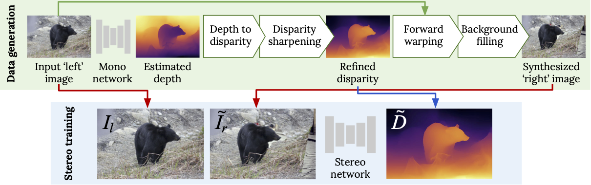
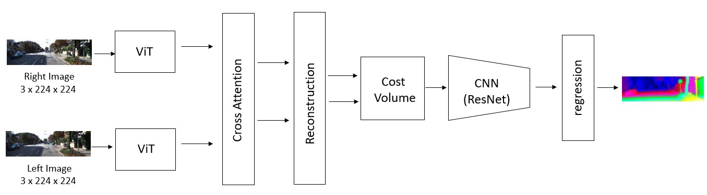

# Project- Learning Stereo from Single Images
[Link to paper](https://arxiv.org/abs/2008.01484)  

<p align="center">
  
</p>

In contemporary research, the task of depth estimation from a stereo pair of images is commonly approached
as a supervised learning challenge, with convolutional neural
networks (CNNs) serving as the backbone architecture. However, prevalent architectures predominantly employ patch-based
Siamese networks, limiting their efficacy in harnessing contextual information for discerning correspondences, especially in
intricate and ill-posed areas. To overcome this constraint, we
introduce an innovative solution, extending the capabilities of the
well-established PSMNet architecture. Our approach facilitates
the generation of accurate disparity maps even with limited stereo
images. While CNNs excel in hierarchical information capture,
Vision Transformers offer a distinct advantage in comprehending
global information. In our proposed architecture, we predominantly leverage a Vision Transformer and an attention mechanism, aiming to adeptly capture intricate spatial relationships,
global context, and semantic features

## Our proposed Network :

<p align="center">
  
</p>

Our proposed approach integrates transformer-based models, cross-attention mechanisms, and convolutional layers, showcasing a comprehensive architecture for stereo matching and disparity estimation.

We propose a novel architecture wherein we employ a
Vision Transformer (ViT) architecture for both left and right
input images, facilitating the capture of intricate spatial relationships,
global context, semantic features, and local details.
The ViT outputs undergo separate cross-attention mechanisms
to emphasize relevant features from both images. A subsequent
reconstruction block refines the obtained features by eliminating
the readout token. The refined features are then utilized
to construct a cost volume, a common representation in stereo
matching, reflecting the similarity of image patches. A CNN
block processes the cost volume to learn hierarchical features,
followed by a regression step to yield the final disparity maps.

You can find the pytorch code for our proposed architecture in the [networks/transformer_psm.py](networks/transformer_psm.py) file.

## Reference paper : 
> Watson, J., Aodha, O. M., Turmukhambetov, D., Brostow, G. J., & Firman, M. (2020). Learning Stereo from Single Images. European Conference on Computer Vision (ECCV).

## Training

To train a new model, you will need to download the datasets: 
[COCO](https://github.com/nightrome/cocostuff). After doing so, update `paths_config.yaml` to point to these directories.
 
 Additionally you will need some precomputed monocular depth estimates for these images. 
 We provide these for MiDaS: [COCO](https://storage.googleapis.com/niantic-lon-static/research/stereo-from-mono/data/mscoco.zip).
 Download these and put them in the corresponding data paths (i.e. your paths specified in `paths_config.yaml`).
 
 Now you can train a new model using:
 ```
CUDA_VISIBLE_DEVICES=X  python  main.py --mode train \
  --log_path <where_to_save_your_model> \
  --model_name <name_of_your_model>

```
Please see `options.py` for full list of training options.
The baseline model is called `hourglass` and out proposed network is called `transformer_psm` which can be selected as a `network` option in the `options.py` python file. 

